{
 "cells": [
  {
   "cell_type": "markdown",
   "metadata": {},
   "source": [
    "# Behavioral Cloning"
   ]
  },
  {
   "cell_type": "markdown",
   "metadata": {},
   "source": [
    "## Introduction"
   ]
  },
  {
   "cell_type": "markdown",
   "metadata": {},
   "source": [
    "The objective of this project is to train a deep neural network model such that it can drive a car around a test track, completely autonomously. \n",
    "\n",
    "The following files are included as part of this project :\n",
    "\n",
    "1. model.ipynb : This is the main script, which defines the deep neural network model, loads the input data, trains the network with the input data and finally generates the model.h5 file containing weights of the network.\n",
    "2. model.h5 : This file contains the weight of the trained network.\n",
    "3. drive.py (provided by udacity) : This script loads the weights of the network, connects to the simulator and predicts the steering output based on the incoming images\n",
    "4. video.mp4 (provided by udacity + bug fix) : Video recording of the final lap on test track in autonomous mode.\n",
    "5. write.ipynp : This file contains in markdown format, to reflect the overall design and test strategy for the project."
   ]
  },
  {
   "cell_type": "markdown",
   "metadata": {},
   "source": [
    "## Model Architecture and Training Strategy"
   ]
  },
  {
   "cell_type": "markdown",
   "metadata": {},
   "source": [
    "Since the objective of the project is to drive autonomously, I have selected the model published by nVidia for their end-to-end training of self driving cars. A representation of the model is shown below (**generated by Keras**). \n",
    "The original paper by nVidia contains 3, 5x5 convolution layers, followed by 2, 3x3 convolution layers, followed by 3 fully connected layers and finally a output node. The original paper does not mention about the choice of activation function neither does it explicitly specify any dropout layers.\n",
    "\n",
    "In this project though, I have used an ELU activation function after every layer. This was compared with plain vanila architecture, without any activation functions and showed better performance. \n",
    "\n",
    "Although the dropout layer is depicted below, it did not perform well in simulations and hence the **keep probability is set to 1, effectively removing any dropouts.**\n",
    "\n",
    "The final model contains **approx 560,000 weights.**\n",
    "\n",
    "The input and output shape of each layer is shown below in detail."
   ]
  },
  {
   "cell_type": "markdown",
   "metadata": {},
   "source": [
    "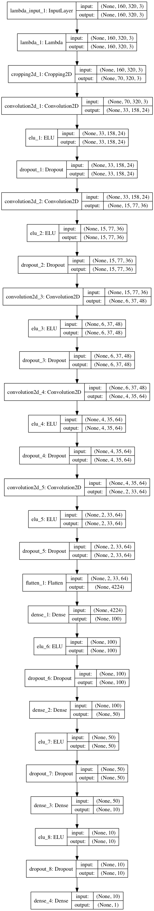"
   ]
  },
  {
   "cell_type": "code",
   "execution_count": null,
   "metadata": {
    "collapsed": true
   },
   "outputs": [],
   "source": [
    "____________________________________________________________________________________________________\n",
    "Layer (type)                     Output Shape          Param #     Connected to                     \n",
    "====================================================================================================\n",
    "lambda_1 (Lambda)                (None, 160, 320, 3)   0           lambda_input_1[0][0]             \n",
    "____________________________________________________________________________________________________\n",
    "cropping2d_1 (Cropping2D)        (None, 70, 320, 3)    0           lambda_1[0][0]                   \n",
    "____________________________________________________________________________________________________\n",
    "convolution2d_1 (Convolution2D)  (None, 33, 158, 24)   1824        cropping2d_1[0][0]               \n",
    "____________________________________________________________________________________________________\n",
    "elu_1 (ELU)                      (None, 33, 158, 24)   0           convolution2d_1[0][0]            \n",
    "____________________________________________________________________________________________________\n",
    "dropout_1 (Dropout)              (None, 33, 158, 24)   0           elu_1[0][0]                      \n",
    "____________________________________________________________________________________________________\n",
    "convolution2d_2 (Convolution2D)  (None, 15, 77, 36)    21636       dropout_1[0][0]                  \n",
    "____________________________________________________________________________________________________\n",
    "elu_2 (ELU)                      (None, 15, 77, 36)    0           convolution2d_2[0][0]            \n",
    "____________________________________________________________________________________________________\n",
    "dropout_2 (Dropout)              (None, 15, 77, 36)    0           elu_2[0][0]                      \n",
    "____________________________________________________________________________________________________\n",
    "convolution2d_3 (Convolution2D)  (None, 6, 37, 48)     43248       dropout_2[0][0]                  \n",
    "____________________________________________________________________________________________________\n",
    "elu_3 (ELU)                      (None, 6, 37, 48)     0           convolution2d_3[0][0]            \n",
    "____________________________________________________________________________________________________\n",
    "dropout_3 (Dropout)              (None, 6, 37, 48)     0           elu_3[0][0]                      \n",
    "____________________________________________________________________________________________________\n",
    "convolution2d_4 (Convolution2D)  (None, 4, 35, 64)     27712       dropout_3[0][0]                  \n",
    "____________________________________________________________________________________________________\n",
    "elu_4 (ELU)                      (None, 4, 35, 64)     0           convolution2d_4[0][0]            \n",
    "____________________________________________________________________________________________________\n",
    "dropout_4 (Dropout)              (None, 4, 35, 64)     0           elu_4[0][0]                      \n",
    "____________________________________________________________________________________________________\n",
    "convolution2d_5 (Convolution2D)  (None, 2, 33, 64)     36928       dropout_4[0][0]                  \n",
    "____________________________________________________________________________________________________\n",
    "elu_5 (ELU)                      (None, 2, 33, 64)     0           convolution2d_5[0][0]            \n",
    "____________________________________________________________________________________________________\n",
    "dropout_5 (Dropout)              (None, 2, 33, 64)     0           elu_5[0][0]                      \n",
    "____________________________________________________________________________________________________\n",
    "flatten_1 (Flatten)              (None, 4224)          0           dropout_5[0][0]                  \n",
    "____________________________________________________________________________________________________\n",
    "dense_1 (Dense)                  (None, 100)           422500      flatten_1[0][0]                  \n",
    "____________________________________________________________________________________________________\n",
    "elu_6 (ELU)                      (None, 100)           0           dense_1[0][0]                    \n",
    "____________________________________________________________________________________________________\n",
    "dropout_6 (Dropout)              (None, 100)           0           elu_6[0][0]                      \n",
    "____________________________________________________________________________________________________\n",
    "dense_2 (Dense)                  (None, 50)            5050        dropout_6[0][0]                  \n",
    "____________________________________________________________________________________________________\n",
    "elu_7 (ELU)                      (None, 50)            0           dense_2[0][0]                    \n",
    "____________________________________________________________________________________________________\n",
    "dropout_7 (Dropout)              (None, 50)            0           elu_7[0][0]                      \n",
    "____________________________________________________________________________________________________\n",
    "dense_3 (Dense)                  (None, 10)            510         dropout_7[0][0]                  \n",
    "____________________________________________________________________________________________________\n",
    "elu_8 (ELU)                      (None, 10)            0           dense_3[0][0]                    \n",
    "____________________________________________________________________________________________________\n",
    "dropout_8 (Dropout)              (None, 10)            0           elu_8[0][0]                      \n",
    "____________________________________________________________________________________________________\n",
    "dense_4 (Dense)                  (None, 1)             11          dropout_8[0][0]                  \n",
    "====================================================================================================\n",
    "Total params: 559,419\n",
    "Trainable params: 559,419\n",
    "Non-trainable params: 0\n",
    "____________________________________________________________________________________________________"
   ]
  },
  {
   "cell_type": "markdown",
   "metadata": {},
   "source": [
    "## Training Strategy"
   ]
  },
  {
   "cell_type": "markdown",
   "metadata": {},
   "source": [
    "### Data collection"
   ]
  },
  {
   "cell_type": "markdown",
   "metadata": {},
   "source": [
    "A sample data set with approx 18,000 images (including left, right, center), was provided by Udacity \n",
    "as a starting point. I used this data set for initial parameter tuning but for the final model I collected a lot more data using the provided simulator. \n",
    "\n",
    "To make the model as generic as possible, without over fitting and keeping training time reasonable, I collected the data in the following manner :\n",
    "\n",
    "1. Approx. 5 laps in the counter clockwise direction (biased towards turning left)\n",
    "2. Approx. 5 laps in the clockwise direction (biased towards turning right)\n",
    "3. Extra laps where I intentionally go a bit off road and then recover for it. Recording was only done for the recovery part.\n",
    "4. Extra rounds of the sharp bends.\n",
    "5. 2 laps of the challenge track.\n",
    "\n",
    "With the above, a total of **approx 64,000** images were collected (including center/left/right).\n",
    "\n",
    "The histogram of the input data shows that the distribution is skewed towards 0 degrees, which represents straight line driving. To remove the bias of driving in a straight line, **I deleted the samples with a steering input of smaller than 0.1 from the input set, with a probability of 0.5.** This reduced the input images to **40992**.\n",
    "\n",
    "I observed that removing the samples too aggressively actually decreases the performance of the network."
   ]
  },
  {
   "cell_type": "markdown",
   "metadata": {},
   "source": [
    "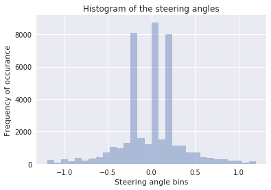"
   ]
  },
  {
   "cell_type": "markdown",
   "metadata": {},
   "source": [
    "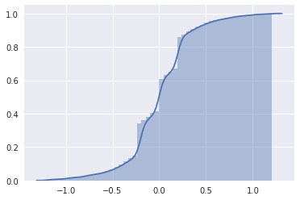"
   ]
  },
  {
   "cell_type": "markdown",
   "metadata": {},
   "source": [
    "### Data Augmentation"
   ]
  },
  {
   "cell_type": "markdown",
   "metadata": {},
   "source": [
    "Although collecting more data is necessary for the proper training of the model, it is not sufficient to ensure that the model trains as generic as possible. To this end, I applied data augmentation techniques presented in this [post](https://chatbotslife.com/using-augmentation-to-mimic-human-driving-496b569760a9).\n",
    "\n",
    "Specifically, the input data is randomly :\n",
    "\n",
    "1. Flipped with a probability of 0.5. This helps in simulating driving in either direction,\n",
    "2. Since drive.py receives data in RGB format, while opencv by default reads in BGR, I converted all the input images from BGR2RGB.\n",
    "3. Next, to ensure that the model trains well for both day and night driving conditions, random brightness scaling was applied to all the images.\n",
    "4. Finally, a horizontal and vertical shift was applied to all the images to simulate the car being driven on different positions on the road.\n",
    "\n",
    "Following is a example set of images before and after augmentation :\n",
    "\n",
    "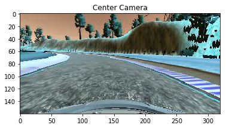\n",
    "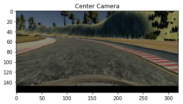\n",
    "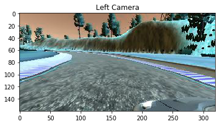\n",
    "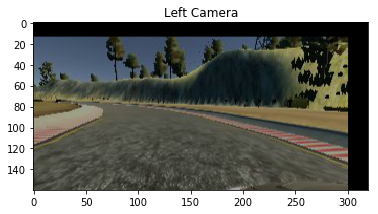\n",
    "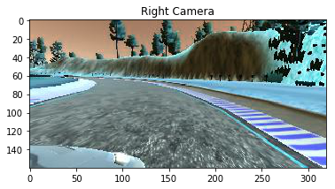\n",
    "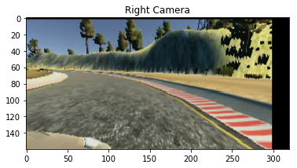"
   ]
  },
  {
   "cell_type": "markdown",
   "metadata": {},
   "source": [
    "## Pre-processing"
   ]
  },
  {
   "cell_type": "markdown",
   "metadata": {},
   "source": [
    "Pre-processing layers are a part of the Keras model. This helps in making the model little bit more flexible, although it should have some computation penalty since the same operations are done on the image in every training epoch. \n",
    "\n",
    "The following 2 layers pre-process the images in Keras:\n",
    "1. The first Lambda layer normalizes the data in the range of 0,1 and mean centers the images to 0, for all the input channels.\n",
    "2. Next, a cropping layer is applied to remove the top 70 pixels which essentially contain information about the landscape and the bottom 20 pixels which contain the hood of the car. These do not provide any information relevant for learning the track as such."
   ]
  },
  {
   "cell_type": "markdown",
   "metadata": {},
   "source": [
    "## Training "
   ]
  },
  {
   "cell_type": "markdown",
   "metadata": {},
   "source": [
    "Since the number of images to be processed is quite high, it is not possible to hold them all in memory at the same time. Therefore, images are processed in batches using **generator functions**(configurable parameter). This allows to read an image from the disk, processes it and then load the next batch.\n",
    "\n",
    "Since this is a regression network, the loss function of choice is **Mean Square Error (MSE)**.\n",
    "\n",
    "**ADAM optimizer** was selected for training and the default parameters performed quite well. I did not get a chance to try different optimizer to compare their performances."
   ]
  },
  {
   "cell_type": "markdown",
   "metadata": {},
   "source": [
    "### Avoiding overfitting"
   ]
  },
  {
   "cell_type": "markdown",
   "metadata": {},
   "source": [
    "To avoid over fitting, I experimented with 3 stratgies.\n",
    "\n",
    "1. Split the input data into test and validation groups. 25 % of data was randomally allocated for validation and the rest 75 % for training.\n",
    "\n",
    "2. Next, I tried the dropout layers and varied the keep probability from 0.7 to 0.9. However, adding of dropout layers, significantly decreased the performance of the network (as is evident in the loss graph in the results section). Therefore, in the final model, the keep probability was fixed to 1.\n",
    "\n",
    "3. Since dropout layers did not perform well, I used L2 regularization with a penalty of 0.001"
   ]
  },
  {
   "cell_type": "markdown",
   "metadata": {},
   "source": [
    "## Results"
   ]
  },
  {
   "cell_type": "markdown",
   "metadata": {},
   "source": [
    "With the above described model and training strategy, the validation loss was seen to be decreasing monotonically till 6 epochs after which point is started to rise and oscillate. Therefore, the training was terminated at iteration 6. \n",
    "\n",
    "**The model is successfully able to drive the car around the test track for multiple rounds (as seen in the attached video, video.mp4).**\n",
    "\n",
    "The model does not perform well on the challenge track though where it gets stuck in the beginning itself. \n",
    "Refinement of the model to run well on the challenge track is a possible future work."
   ]
  },
  {
   "cell_type": "markdown",
   "metadata": {},
   "source": [
    "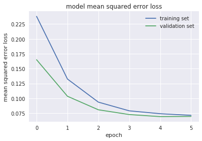"
   ]
  },
  {
   "cell_type": "markdown",
   "metadata": {},
   "source": [
    "Validation and training loss with droupout layers."
   ]
  },
  {
   "cell_type": "markdown",
   "metadata": {},
   "source": [
    "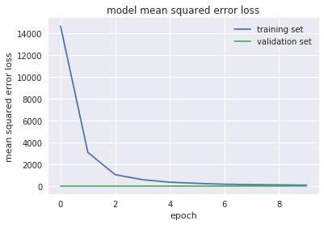"
   ]
  }
 ],
 "metadata": {
  "kernelspec": {
   "display_name": "Python 3",
   "language": "python",
   "name": "python3"
  },
  "language_info": {
   "codemirror_mode": {
    "name": "ipython",
    "version": 3
   },
   "file_extension": ".py",
   "mimetype": "text/x-python",
   "name": "python",
   "nbconvert_exporter": "python",
   "pygments_lexer": "ipython3",
   "version": "3.5.2"
  },
  "widgets": {
   "state": {},
   "version": "1.1.2"
  }
 },
 "nbformat": 4,
 "nbformat_minor": 2
}
